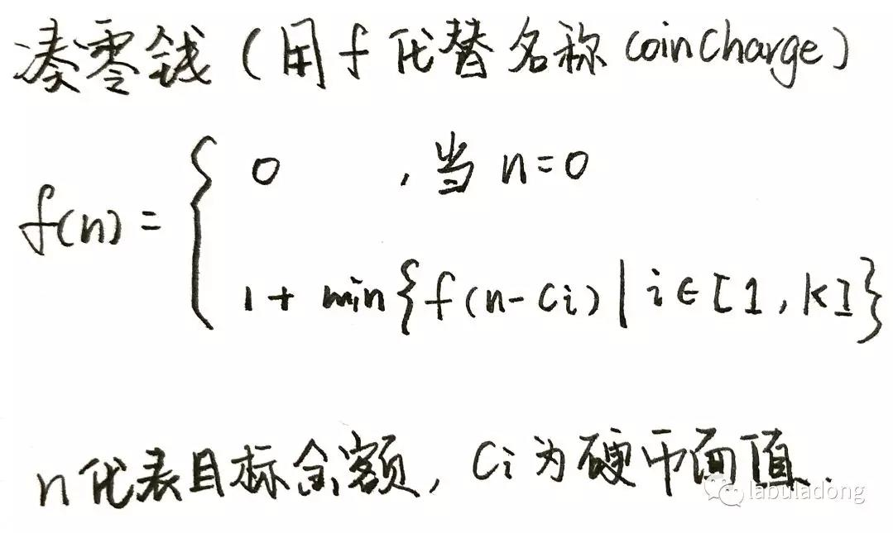

# 算法总结 #

语言基础要有一到两个擅长，对语法要比较熟悉。

数据结构也是考察重点：

* 数组
* 字符串
* 链表
* 树（二叉树，红黑树）
* 栈
* 队列
* 哈希表
* 位数组/位操作

常用算法：

* 查找: 二分查找
* 排序：归并排序，快速排序，堆排序
* 递归
* 分治算法
* 动态规划：
* 贪婪算法
* 贪婪算法

在面对实际问题时，要采用画图，举例以及分解等方法帮助寻找思路。

**`C++`基础**

`C++`对象内存模型，虚表，继承

类构造与析构函数，符号重载，成员初始化顺序。


## 算法示例 ##

《编程珠玑》第二版中题目汇总。

### 整数排序 ###

所输入的是一个文件，至多包含n个整数，每个整数都要小于n，这里n=10^7。如果输入某个整数出现了两次，就导致错误。这些整数与任何数据都不关联。以增序形式输出经过排序的整数列表。至多只有1MB的可用主存；但是可用磁盘空间非常充足。运行时间至多只允许几分钟，10秒钟是最适宜的运行时间。

**解法1**

1M内存可以存储250000个32位数字，所以可以将文件分为40次排序，第一次排0-249999之间的数，将它写入一个文件；然后依次排序后面39个区间。最后将排序完成的四十个文件拼接起来形成最终文件。

**解法2**

其实这里要求所有的数组不出现重复，所以可以用位图的方式来进行。比如2M内存，就有足够的位来表示 10^7 的数，这样在O(n)时间内就可以完成排序。但是如果严格限制1M，而10^7最少需要 1.25M内存，所以这里可以参考解法1，将所有数据分为两个区间来排序—— 小于5000000依次排序，大于5000000的数一次排序即可。

### 查找不存在的数字 ###

给定一个包含32位整数的顺序文件，至多只能包含40亿个这样的整数（肯定是正整数），并且整数的次序随机。请查找一个此文件中不存在的32位整数（至少必有一个数不存在）。在足够主存情况下会如何解决问题？如果你可以使用若干外部临时文件但主存却只有上百个字节，如何解决这个问题？

**问题1**

在主存足够的情况下，可以用 512M内存位图，其中每一位表示一个对应的32位正整数，如果数字在文件中，则将对应位置1。当遍历完文件后，遍历一下位图，发现为0的位对应的数字即不再文件中。

**问题2**

内存只有几百字节，将数字读入排序则是不现实的。有外部临时文件可用，可以采用二分法进行查找。即将文件中数字以 `2147483648`为界，将大于等于它的值分到一个文件，小于等于它的数组分到另外一组；统计两个文件中的数组，以少的一方为总，再继续以二分法对文件进行分割存储。当最后剩下几十个数组时，即可读入内存判断那个数组不存在。

###一维向量旋转###

请将一个具有n个元素的一维向量向左旋转i个位置。例如假设n=8，i=3，那么向量abcdefgh旋转之后得到向量defghabc。简单编码，使用一个具有n个元素的中间向量分n步完成此作业。你也可以仅使用几十字节微小内存，花费与n成比例的时间来完成旋转该向量吗？

**问题1**

使用中间向量对数组进行旋转比较简单，只需要将要旋转的i个字符复制到中间向量，然后再将后面字符串向前移动i个位置，将中间向量中的字符串拼接到移动后的字符串即可。

```
bool rotate(char* lpVec, int n, int i)
{
	if(lpVec == NULL || n <= 0 || n < i)
    	return false;

    if (n == i)
    	return true;

	char * lpTemp = malloc(i);
    if (lpTemp == NULL)
    	return false;
    for(int nI = 0; nI < i; nI++)
    	lpTemp[nI] = lpVec[nI];

    for(int nI = i, nJ = 0; nI < n; nI++, nJ++)
    	lpVec[nJ] = lpVec[nI];
	for(int nI = 0, nJ = n - i; nI < i; nI++, nJ++)
    	lpVec[nJ] = lpTemp[nI];

    free(lpTemp);
    return true;
}
```

**问题2**

如果可使用字节只有几十字节，无法满足要旋转大小。则可以采用就地多次旋转的方式，`abcdefgh`可以分为两部分`abc` 和`defgh`，首先将两部分进行反转可以得到`cba`和`hgfed`，然后再将整体字符串进行反转可得`defghabc`，即实现了旋转。

```
void revert(char* lpvec, int nlen)
{
	if (lpvec == NULL || nlen <= 0)
    	return ;

    for(int i = 0; i < nlen / 2; i++)
    {
    	char tmp = lpvec[i];
        lpvec[i] = lpvec[nlen - 1 - i];
        lpvec[nlen - 1 - i] = tmp;
    }
}

bool rotate(char* lpVec, int n, int i)
{
	if(lpVec == NULL || n <= 0 || n < i)
    	return false;

    if (n == i)
    	return true;

	revert(lpVec, i);
    revert(lpVec + i, n-i);
    revert(lpVec, n);

	return true;
}
```

### 同位词 ###

给定一本英语单词词典，请找出所有的变位词集合。例如因为“pots”，“stop”，“tops”相互之间都是有另一个词的各个字母改变顺序构成，因此这些词相互之间就是变位词。

**解法**

可以求出每个单词的签名，比如将单词的字母按照顺序进行排序，这即该单词签名。然后使用哈希表的方法，遍历整个字典，将具有相同签名的单词放到一个串中，这样即可找出所有的同位词。

### 一维模式识别 ###

输入一个具有n个浮点数字的向量x，其输出是在输入的任何相邻子向量中找出最大和。例如，如果输入向量为如下10个元素，返回值则返回x[2..6]的总和。


```
31 -41 59 26 -53 58 97 -93 -23 84
```

> 四个算法，三阶，二阶，线性

**解法1**

循环遍历所有的子数组，计算其和，然后求出最大的子数组。但是这种解法的时间复杂度为O(n^3)。

```
void MaxSubArray(int vecNums[], int nlen)
{
	int tI = -1, tJ = -1;
	int maxsum = 0;
	for (int i = 0; i < nlen; i++)
	{
		for(int j = i; j < nlen; j++)
		{
			int sum = 0;
			for(int k = i; k <= j; k++)
			{
				sum += vecNums[k];
			}

			if (maxsum < sum)
			{
				maxsum = sum;
				tI = i;
				tJ = j;
			}
		}
	}

	printf("maxsum: %d, i: %d, j: %d\n", maxsum, tI, tJ);
}
```

**解法2**

从算法1中可以看出，其实最内层的循环中不停在计算重复的数据，所以可将内层的循环省略，以`sum[i..j-1]`值来推算`sum[i..j]`的值。

这样就得到一个时间复杂度为`O(n^2)`的算法。

```
void MaxSubArray(int vecNums[], int nlen)
{
	int tI = -1, tJ = -1;
	int maxsum = 0;
	for (int i = 0; i < nlen; i++)
	{
		int sum = 0;
		for(int j = i; j < nlen; j++)
		{
			sum += vecNums[k];

			if (maxsum < sum)
			{
				maxsum = sum;
				tI = i;
				tJ = j;
			}
		}
	}

	printf("maxsum: %d, i: %d, j: %d\n", maxsum, tI, tJ);
}
```

**解法3**

对于一个数组要求最大子数组，这个问题可以进行分解，将数组分为两个子数组，分别求两个子数组的最大值。一旦分割之后，会有问题存在，如果当前最大和子数组跨越中线怎么办，所以还需要求一下以中线向两边延伸的子数组的最大和。

这个问题可以使用递归实现，时间复杂度在`O(nlogn)`。

**解法4**

最后一个解法要达到`O(n)`的时间复杂度，使用动态规划，初始化一个最大值数组`MaxSum[n]`，`MaxSum[i]`就表示`A[0...i]`以`A[i]`结尾的子数组最大和，那么`MaxSum[i]`就等于`A[0...i-1]`的最大和加上`A[i]`在和`A[i]`比较求最大值，`MaxSum[i] = Max{ MaxSum[i-1] + A[i], A[i]}`。

```
#define max(a, b) (a) > (b) ? (a) : (b)

void MaxSubArray(int vecNums[], int nlen)
{
	if (vecNums == NULL || nlen <= 0)
    	return ;

	int maxsum = 0;
    int *lpMaxSum = (int*)malloc(nlen);
    if (NULL == lpMaxSum)
    	return ;

    lpMaxSum[0] = vecNums[0];
	for (int i = 1; i < nlen; i++)
	{
    	lpMaxSum[i] = max(lpMaxSum[i-1] + vecNums[i], vecNums[i]);
	}

    for(int i = 0; i < nlen; i++)
    {
    	if(lpMaxSum[i] > maxsum)
        	maxsum = lpMaxSum[i];
    }

	printf("maxsum: %d \n", maxsum);
}
```

从上述求解max来看，一旦在i上，出现了`lpMaxSum[i-1] + vecNums[i] < vecNums[i]`，其后的值马上从`vecNums[i]`开始累加了，可以将上述算法进行简化。

```
void MaxSubArray(int vecNums[], int nlen)
{
	if (vecNums == NULL || nlen <= 0)
    	return ;

    int maxsum = 0;
    int thissum = 0;
    for(int i = 0; i < nlen; i++)
    {
    	thissum += vecNums[i];
    	if(thissum > maxsum)
        	maxsum = thissum;
        else if(thissum < 0){
        	thissum = 0;
        }
    }

	printf("maxsum: %d \n", maxsum);
}
```

### 排序算法 ###

**冒泡排序**

冒泡排序时间复杂度为O(n^2)。

```
void BubbleSort(int vecNums[], int num)
{
	if(vecNums == NULL || num <= 0)
    	return ;

	for(int i = 0; i < num - 1; i++)
    {
    	for(int j = 0; j < num - 1 - i; j++)
        {
        	if (vecNums[j] > vecNums[j+1])
            {
            	int temp = vecNums[j];
                vecNums[j] = vecNums[j + 1];
                vecNums[j + 1] = temp;
            }
        }
    }
}
```

**插入排序**

插入排序时间复杂度为O(n^2)。
```
void InsertSort(int vecNums[], int num)
{
	if(vecNums == NULL || num <= 0)
    	return ;

	for (int i = 1; i < num; i++)
    {
    	int j = i;
    	int target = vecNums[i];
    	for (j = i; j > 0; j--)
        {
        	if (target < vecNums[j-1])
            {
                vecNums[j] = vecNums[j-1];
            }
            else
            {
            	vecNums[j] = target;
                break;
            }
        }
    }
}
```
**快速排序**

快速排序使用了分治法，将向量分为两个子向量，再递归对其进行排序。其时间复杂度为O(nlogn)。其实快速排序与性能最差的时候，即原始数组是逆序的时候，时间复杂度大到O(n^2)。

```
void QuickSort(int vecNums[], int left, int right)
{
	if (vecNums == NULL || left >= right)
    	return ;

    int target = vecNums[left];
    int i = left, j = right;
    while(i < j)
    {
    	while(i < j && key <= a[j])
        	j--;
        a[i] = a[j];

        while(i < j; key >= a[i])
        	i++;
        a[j] = a[i];
    }
    a[i] = target;
    QuickSort(vecNums, left, i-1);
    QuickSort(vecNums, i+1, right);
}
```

**堆排序**

使用类似完全平衡二叉树的思想，将堆的高度限制为 logn，排序n个节点，时间复杂度最多也就是O(nlogn)，并且没有额外空间的使用，只需要n个空间的原始向量即可。

```
void max_heap(int vecNums[], int start, int end)
{
	int dad = start;
	int son = dad * 2 + 1;
	while (son <= end)
	{
		// 判断有 右子节点， 如果有，判断左子节点是否小于右子节点
		// 用于判断 与 dad 节点进行对比的 子节点是哪个。
		if(son + 1 <= end && vecNums[son] < vecNums[son+1])
			son++;
		if(vecNums[dad] >= vecNums[son])
		{
			return ;
		}
		else
		{
			int temp = vecNums[son];
			vecNums[son] = vecNums[dad];
			vecNums[dad] = temp;

			dad = son;
			son = dad * 2 + 1;
		}
	}
}

void HeapSort(int vecNums[], int num)
{
	if (vecNums == NULL || num <= 1)
		return ;

	for(int i = num / 2; i >= 0; i--)
		max_heap(vecNums, i, num - 1);

	for(int i = num - 1; i >= 0; i--)
	{
		int target = vecNums[0];
		vecNums[0] = vecNums[i];
		vecNums[i] = target;
		max_heap(vecNums, 0, i - 1);
	}
}
```

> 十大排序算法： https://mp.weixin.qq.com/s/IAZnN00i65Ad3BicZy5kzQ

### 字符串最长子串 ###

给定一个输入文本文件，查找其中最常的重复子字符串。例如“Ask not what your country can do for you, but what you can do for your country”中最常的重复字符串就是“can do for you”，“your country”是第二长子串。如何编写解决这个问题的程序？

**算法1**

二次循环，计算出所有的子串，然后找到最长重复子串。时间复杂读为O(n^2)

```
void maxsubstr(std::string &fullstr)
{
	std::string maxstr;
	std::vector<std::string> vecSubstrs;
	for(int i = 0; i < fullstr.length(); i++)
	{
		for(int j = i; j < fullstr.length(); j++)
		{
			std::string substr = fullstr.substr(i, j);
			if (vecSubstrs.end() != std::find(vecSubstrs.begin(), vecSubstrs.end(), substr))
			{
				if(substr.length() > maxstr.length())
					maxstr = substr;
			}
			else
			{
				vecSubstrs.push_back(substr);
			}
		}
	}

	printf("max sub string: %s\n", maxstr.c_str());
}
```

**算法2**

使用后缀数组，时间复杂度为O(nlogn)。比如如下的例子：

```
a[0] banana
a[1] anana
a[2] nana
a[3] ana
a[4] na
a[5] a

排序 -->

a[0] a
a[1] ana
a[2] anana
a[3] banana
a[4] na
a[5] nana
```

依次从前向后进行两两进行对比（如果前一个是后一个的子串，就可以将它记录下来），这样就可以找出最长的相同子串了。

```
void maxsubstr(std::string &fullstr)
{
	std::string maxstr;
	std::vector<std::string> vecSubstrs;
	for(int i = 0; i < fullstr.length(); i++)
	{
        vecSubstrs.push_back(fullstr.substr(i, fullstr.length()));
	}

    std::sort(vecSubstrs.begin(), vecSubstrs.end());

    for(int i = 0; i < vecSubstrs.size() - 1; i++)
    {
    	if(strncmp(vecSubstrs[i].c_str(), vecSubstrs[i+1].c_str(), vecSubstrs[i].length()) == 0)
        	maxstr = vecSubstrs[i];
    }

	printf("max sub string: %s\n", maxstr.c_str());
}
```

### 字符串转整数 ###

将一个字符串转换成整数。

> 考察代码完整性，鲁棒性（边界值，输入参数检查，输入错误等）

```
bool StrToInt(char* str, int& value)
{
	if(str == NULL)
    	return false;

	bool hassign = false;
    int index = 0;
	int sign = 1;
    if(str[0] == '-')
    {
    	sign = -1;
        index++;
        hassign = true;
    }
    else if(str[0] == '+')
    {
    	index++;
        hassign = true;
    }
    if (hassign && str[index] == 0)
    	return false;

    value = 0;
    while(str[index] != 0)
    {
    	if(str[index] < '0' || str[index] > '9')
        	return false;

    	value = value * 10 + str[index] - '0';

        index++;
    }

    value *= sign;
    return true;
}
```

### 求链表中倒数第K个节点 ###

给一个链表，求链表的倒数第k个节点。

> 这个题目使用快慢指针也比较简单，但是要考虑程序完整性与鲁棒性


```
ListNode* FindKthToTail(ListNode* pListHead, unsigned int k)
{
	if(NULL == pListHead || k < 0)
    	return NULL;

	ListNode* first = pListHead;
    ListNode* second = pListHead;
    int nIndex = 0;
    while(nIndex < k-1) // 指向第一个节点，走k-1步，则指向第k个节点
    {
    	if (first->next)
        	first = first->next;
        else
        	return NULL;
    	nIndex++;
    }

    while(first->next)
    {
    	first = first->next;
        second = second->next;
    }

    return second;
}
```

> 在解答简单题目时，一定考虑边界条件，特殊输入（NULL，空串，错误字符串等）以及错误处理。


### 递归算法 ###

斐波那契数列，典型的递归算法计算。

青蛙跳台问题，一只青蛙一次可以跳上一级台阶，也可以跳上2级台阶，请问这只青蛙跳上n级台阶总共有多少种跳法。

**方案**

青蛙跳台其实就是一个变像的斐波那契数列。n个台阶，那么跳上第n阶之前的位置呢，n-1 或 n-2，问题就分解为要跳上n-1阶的跳法加上跳上n-2阶的跳法，所以`f(n) = f(n-1) + f(n-2)`。

```
// 递归解法
int Fib(n)
{
	if (n == 0 || n == 1)
    	return 1;

    return Fib(n-1) + Fib(n-2);
}

// 循环解法
int Fib(n)
{
	int nsum = 0;
    if (n == 0 || n == 1)
    	return 1;

	int fib0 = 1, fib1 = 1;
    for(int i = 2; i < n; i++)
    {
    	nsum = fib0 + fib1;

        fib0 = fib1;
        fib1 = nsum;
    }

	return nsum;
}
```

### 二维数组查找 ###

** 题目描述 **

在一个二维数组中（每个一维数组的长度相同），每一行都按照从左到右递增的顺序排序，每一列都按照从上到下递增的顺序排序。请完成一个函数，输入这样的一个二维数组和一个整数，判断数组中是否含有该整数。

最坏的解决方法就是将整个数组进行遍历，二维数组，时间复杂度为 O(n^2)。

```
[
	[1, 2,  4,  8],
    [2, 4,  7,  9],
    [5, 6,  8, 11],
    [7, 9, 10, 12],
]
```

观察数组可以发现，从数组左下角到右上角的斜线上，所有上半部的元素都小于斜线上的值，下半部的元素则大于斜线上的值。所以在可以从左下角或右上角开始遍历数组。

以左下角开始遍历为例，如果当前元素等于目标值，则返回，否则，如果当前元素小于目标元素则向右移动一列，否则，向上移动一行。这样可以以比较小的时间复杂度完成。

```
class Solution {
public:
    bool Find(int target, vector<vector<int> > array) {
        bool bFind = false;
        int nX = 0;
        int nY = array[0].size() - 1;
        while(nX < array.size() && nY >= 0)
        {
            if(array[nX][nY] == target)
            {
                bFind = true;
                break;
            }

            if(array[nX][nY] < target)
            {
                nX++;
            }
            else if(array[nX][nY] > target)
            {
                nY--;
            }
        }

        return bFind;
    }
};
```

### 替换空格 ###

**题目描述**

请实现一个函数，将一个字符串中的每个空格替换成“%20”。例如，当字符串为We Are Happy.则经过替换之后的字符串为We%20Are%20Happy。

**方案**

对于这种已经给定了函数声明，那就是要在源字符串上进行操作。从头到尾依次查找空格，然后将空格后的字符串向后平移两个位置，这样也能完成操作，时间复杂度为O(n^2)。可以采用从尾部向头部遍历的方式，提前计算出字符串中的空格，然后计算出需要额外占据的空间。从字符串尾部开始遍历字符串，遇到空格则逆向填入`%20`三个字符，这样就能在O(n)时间内处理完成。

```
class Solution {
public:
	void replaceSpace(char *str,int length) {
    	if (str == null || length <= 0)
        	return ;

        char * orgStr = str;
        int strLen = 0;
        int emptyNum = 0;
        while(*orgStr != 0)
        {
            strLen++;
            if (*orgStr == ' ')
                emptyNum++;
            orgStr++;
        }

        int newLen = strLen + emptyNum * 2;
        if (newLen > length)
            return ;

        orgStr = str + strLen;
        char * replStr = str + newLen;
        while (orgStr >= str)
        {
            if(*orgStr != ' ')
            {
                *replStr-- = *orgStr;
            }
            else
            {
                *replStr-- = '0';
                *replStr-- = '2';
                *replStr-- = '%';
            }
            orgStr--;
        }
	}
};
```

### 两数之和 ###

给定一个整数数组 nums 和一个目标值 target，请你在该数组中找出和为目标值的那 两个 整数，并返回他们的数组下标。
你可以假设每种输入只会对应一个答案。但是，你不能重复利用这个数组中同样的元素。

```
给定 nums = [2, 7, 11, 15], target = 9

因为 nums[0] + nums[1] = 2 + 7 = 9
所以返回 [0, 1]
```

**方案一**

最简单的方法就是内外两个循环，依次将数组两个元素相加，如果等于target，则找到。这种方法的时间复杂度为O(n^2)。

**方案二**

将数组元素放到哈希表中，然后依次用target和数组元素的差搜索哈希表，这样可以将时间复杂度降低为O(n)。利用哈希表，额外占用空间，但是时间复杂度可以降低为O(n)。

```
class Solution {
public:
    vector<int> twoSum(vector<int>& nums, int target) {
        vector<int> vecRet;
        std::map<int, int> hashMap;

        int nNums = nums.size();
        for(int i = 0; i < nNums; i++)
        {
            hashMap.insert(std::pair<int,int>(nums[i], i));
        }

        for(int i = 0; i < nNums; i++)
        {
        	if (nums[i] > target)
            	continue;

            int diffVal = target - nums[i];
            if( hashMap.find(diffVal) != hashMap.end() && i != hashMap[diffVal])
            {
                vecRet.push_back(i);
                vecRet.push_back(hashMap[diffVal]);
                break;
            }
        }

        return vecRet;
    }
};
```

> 来源：力扣（LeetCode）

### 赋值运算符函数 ###

`C++` 赋值运算符

```
class CMyString
{
public:
	CMyString(char* pData = NULL);
    CMyString(const CMyString& str);
    ~CMyString(void);

private:
	char* m_pData;
};
```

> 传参为常量，返回为 对象引用（否则无法连续赋值），被赋值变量资源释放，同一实例判断


### 从尾到头打印链表 ###

输入一个链表，按链表值从尾到头的顺序返回一个ArrayList。

**解法**

```
/**
*  struct ListNode {
*        int val;
*        struct ListNode *next;
*        ListNode(int x) :
*              val(x), next(NULL) {
*        }
*  };
*/
class Solution {
public:
    vector<int> printListFromTailToHead(ListNode* head) {
        vector<int> vecOut;
        if (head == NULL)
            return vecOut;
        std::stack<int> stkList;
        ListNode *lpItem = head;
        while(lpItem != NULL)
        {
            stkList.push(lpItem->val);
            lpItem = lpItem->next;
        }

        while(!stkList.empty())
        {
            vecOut.push_back(stkList.top());
            stkList.pop();
        }

        return vecOut;
    }
};
```

###洗牌算法###

对于一副扑克48张，设计一个洗牌的算法，保证其公平性。

**算法1**

对于n张牌，要洗牌且公平，其实就是每张牌在某个位置出现的概率相同，那么这n张牌一共有多少中排列方式呢？`n!`种。所以从这`n!`种排序中选其中一种排列方式，其实得到了一种结果，且公平。

要获取这`n!`中的一种排序方式，时间复杂度大约为`O(n!)`，这是比`2^n`还要大的一种时间强度。

**算法2**

其实洗牌算法有一种超简单的方式，即`Knuth`洗牌算法。

```
for(int i = n - 1; i >= 0; i--)
	swap(arr[i], arr[rand() % (i+1)]);
```

按照这个算法，如何证明它的公平性呢，前面说过要实现公平其实就是要每张牌出现在每个位置的几率相等。以如下的无张牌为例说明一下。

```
[1][2][3][4][5] -> [1][2][5][4]|[3]

[1][2][5][4]|[3] -> 
```

对于第一轮，这里要置换的位置为5，而所选择的要置换的牌，因为使用了 `rand() % (i+1)`则可以认为选中每一张牌的概率相等（别争辩说`rand()`函数是个伪随机），即`1/5`。选定了第一张，比如是3。第二次选的时候，从四张牌中选定一张的概率是`1/4`，但是其从所选的四张牌选择的概率是`4/5`，前面已经选择了一张放到最后位置上，所以第四个位置上选择定一张牌的概率为`4/5*1/4=1/5`

###凑零钱###

题目：给你 k 种面值的硬币，面值分别为 c1, c2 ... ck，再给一个总金额 n，问你最少需要几枚硬币凑出这个金额，如果不可能凑出，则回答 -1。比如说，k = 3，面值分别为 1，2，5，总金额 n = 11，那么最少需要 3 枚硬币，即 11 = 5 + 5 + 1 。

动态规划遵循一套固定的流程：`递归的暴力解法 -> 带备忘录的递归解法 -> 非递归的动态规划解法`，其实这是一步一步优化的结果。可以使用动态规划解决的题目都有这么几个性质：1. 重叠子问题，即在计算最终结果过程中要计算很多相同的内容，比如斐波那契数的计算中，`f(n)=f(n-1)+f(n-2)`，其实这个式子在计算中如果采用递归，需要计算很多重复的子问题，比如`f(10)=f(9)+f(8)`，其中计算了`f(8)`，而在计算`f(9)`时则是`f(9)=f(8)+f(7)`，所以`f(8)`被重复计算了。前面那个计算斐波那契数的方程在动态规划算法中叫做状态转移方程，它是解决问题的关键。2. 最优子结构，它是动态规划的另一个重要特性，其实在这个凑零钱的算法中就会有最优子结构的使用了，比如下图为本题目的状态转移方程，可以看出如果要求解`f(n)`，则需要求出`f(n-ci)`，并得到其中的最优解。要符合最优解，则必须满足子问题间的相互独立，否则两个子问题相互依赖，则每个问题很难有最优解。当在题目中要求最优解，或代码中有循环和max/min等函数，则多数都可用动态规划进行优化。



**解法1**

动态规划算法一般都可以使用递归的方法解决，只是时间或空间复杂度很大而已。按照上述的状态转移方程可以得到如下的递归代码。

```
int coinChange(vector<int> &coins, int amount){
	if(amount == 0)
    	return 0;

    int ans = INT_MAX;
    for(int coin: coins)
    {
    	if(amount - coin < 0) continue;
        int subProb = coinChange(coins, amount - coin);
        if(subProb == -1) continue;

        ans = min(ans, subProb + 1);
    }

	return ans == INT_MAX ? -1 : ans;
}
```

**解法2**

从递归算法中可以看到，在递归过程中其实计算了很多相同的比如`f(11)`计算中会计算`f(9)`，而在`f(10)`计算中也会计算`f(9)`，所以与斐波那契数的计算类似，也可以将这些中间结果保存。

```
int coinChange(vector<int>& coins, int amount) {
    // 备忘录初始化为 -2
    vector<int> memo(amount + 1, -2);
    return helper(coins, amount, memo);
}

int helper(vector<int>& coins, int amount, vector<int>& memo) {
    if (amount == 0)
    	return 0;

    if (memo[amount] != -2)
    	return memo[amount];

    int ans = INT_MAX;
    for (int coin : coins) {
        if (amount - coin < 0) // 金额不可达
        	continue;
        int subProb = helper(coins, amount - coin, memo);
        if (subProb == -1) // 子问题无解
        	continue;
        ans = min(ans, subProb + 1);
    }
    // 记录本轮答案
    memo[amount] = (ans == INT_MAX) ? -1 : ans;
    return memo[amount];
}
```

**解法3**

有了前面的带备忘录的递归算法，也能很容易转换为动态规划的方式，带备忘录的递归算法是采用从顶向底的计算，而动态规划则是采用从底向顶的计算方式，即从`f(1)->f(2)->f(3)...->f(n)`。

```
int coinChange(vector<int>& coins, int amount) {
    vector<int> dp(amount + 1, INT_MAX);

    dp[0] = 0;
    for (int i = 0; i < dp.size(); i++) {
        for (int coin : coins) // 内层 for 在求所有子问题 + 1 的最小值
        {
            if (i - coin < 0) //
            	continue;
            dp[i] = min(dp[i], 1 + dp[i - coin]);
        }
    }

    return dp[amount] == INT_MAX ? -1 : dp[amount];
}
```

### 最长递增子序列 ###

给定一个无序的证书数组，找到其中最常上升子序列的长度。比如输入`[10,9,2,5,3,7,101,18]`，其输出为4，最常的上升子序列为`[2,3,7,101]`。

> 注意「子序列」和「子串」这两个名词的区别，子串一定是连续的，而子序列不一定是连续的。

**解法1**

最简单的解法是使用两次循环，查找所有子数组中的递增序列长度，就能找到最常的了。其时间复杂度为`O(n^2)`

```
void MaxIncrementList(int *lpNums, int nlen)
{
	int nMaxLen = 0;

    for(int i = 0; i < nlen; i++)
    {
    	for(int j = i + 1; j < nlen; j++)
        {
        	int subMax = 0;

            if(lpNums[j] > lpNums[j-1])
            	subMax++;

        	nMaxLen = max(nMaxLen, );
        }
    }
	return ;
}
```

**解法2**

动态规划来解题，动态规划算法的核心思想是数学归纳法，比如我们想证明一个数学结论，那么我们先假设这个结论在 `k<n` 时成立，然后想办法证明 `k=n` 的时候此结论也成立。如果能够证明出来，那么就说明这个结论对于 k 等于任何数都成立。

所以这里假设`dp[0..i-1]`，都已经计算了，`dp[i]`表示以下表i结尾的数组的最大升序子序列，那么`d[i]`该如何计算呢？这就是状态转移方程的提炼，一旦计算完了`dp`中所有的项，那么找出其中的最大值即最终结果。

`dp[i]`在这个题目中该如何计算呢，其实就是查找i索引之前依次递减的序列。所以这个动态规划的算法的时间复杂度也为`O(n^2)`。


### 位运算操作 ###

https://mp.weixin.qq.com/s/C6o6T9ju34vAxNBg5zobWw

https://mp.weixin.qq.com/s/6HpCx2u_m1DGuReeJxMwIg

### 搜索旋转排序数组 ###

https://mp.weixin.qq.com/s/t3llCqCFnPCA7kZi5bBwtg


