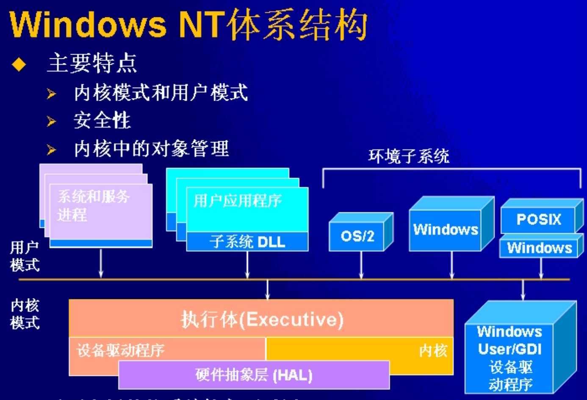
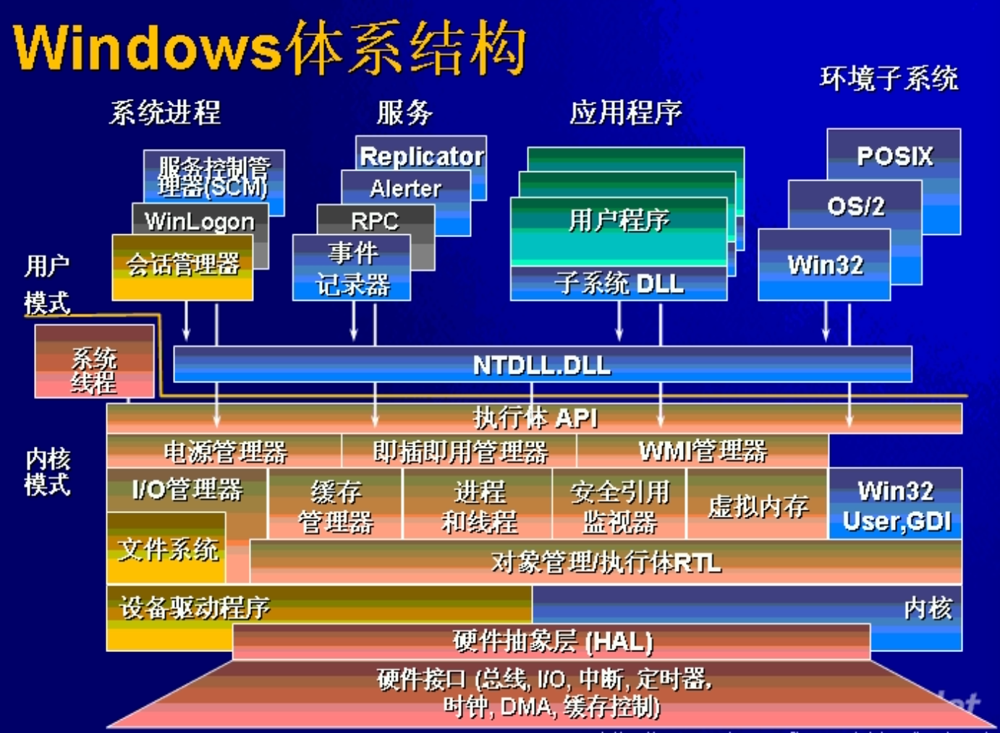
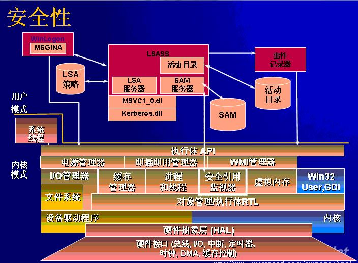

### Windows历史 ###

**Windows历史**

WinXP是Win2000的继任版本，主要是用于普通消费用户。`Windows 2003 Server`则是`Windows 2000 Server`的后继版本，主要用于服务器。之后出现Vista系统，它比较大的变化是界面重新设计，其次是安全性大大增强，再依次出现了Win7，Win8，Win8.1，Win10；其中每个桌面版的系统都对应着一个服务器的版本，Win10对应的服务器版本为`Windows 2016 Server`。

WinXP是其中的一个里程碑：
* 稳定性和效率比较好
* 全新的图形界面，采用`Visual Style`
* 采用软件激活对抗盗版
* SP2中发布安全性补丁，防火墙增强，IE的增强。

**Window中，比较有特色的地方**

* Windows开发模型：
	消息机制，窗口机制，注册表，Hook
* Windows的组件模型：
	DLL，COM，COM+，.NET
* Windows的分布式服务：
	目录服务，分布式安全服务（Kerberos和IPSec，TLS）COM+，ADO，事务管理
* Windows内核的进一步理解:
	查看一些内核源码，理解更多内核的内容

### Windows NT体系结构 ###

从大的体系结构来说，Windows NT的架构没有发生根本变化。如下为NT的基本结构。

NT体系结构的主要特点：

* 内核模式和用户模式分割
* 安全性考虑，在设计时已经考虑到安全性问题。
* 内核中的对象管理，内核中各种资源以对象方式管理。

如下图为一副比较完整的Windows体系结构：

**内核模式与用户模式**

两个模式的形成是由硬件控制的处理器状态，两个模式的存在，控制对内存的访问。内存读写控制：保护系统页面，用户程序不能访问；用户进程相互隔离；对代码区域保护，不可写。两个模式也控制能否执行特权指令。WindowsNT使用的CPU模式: Intel处理器的Ring0，Ring3。

两种模式下切换：系统调用和中断发生。线程可以在两个模式下切换，与线程调度无关。

**关键系统文件**

如下为Windows NT体系结构中一些关键的系统文件：

|    模块名字   |     组件    |
|--------------|------------|
|Ntoskrnl.exe  | 执行体和内核|
|Ntkrnlpa.exe  | 支持PAE的执行体和内核 |
|Hal.dll       | 硬件抽象层 |
|Win32.sys     | Win32子系统的内核模式部分 |
|Ntdll.dll     | 内部支持函数和执行体函数存根函数 |
|Kernel32.dll等 | 核心的Win32子系统DLL |

`Ntoskrnl.exe`按照上面体系图可知，它其实是有两部分组成，内核和执行体，其中执行体比较复杂，包括电源管理，I/O管理，WMI管理器，缓存管理，进程与线程管理，虚拟内存等。`Hal.dll`将硬件与软件层隔开，对硬件层进行了抽象，不同的硬件有不同的`Hal*`支持。

Windows子系统：

1. 环境子系统进程
	控制台
	创建和删除进程
	16位虚拟DOS机支持
    其他一些支持
2. 内核模式驱动程序Win32k.sys
	窗口管理：控制窗口显示，屏幕输出，手机来自键盘，鼠标和其他设备输入，把用户消息传给程序。
	图形设备接口GDI：针对图形输出设备的函数库，画线，文本和各种图形函数。
3. 子系统DLL
	Kernel32.dll，Advapi32.dll等
4. 图形设备驱动程序
	硬件相关的图形显示驱动程序，带你及程序，视频为端口驱动程序

**用户程序和系统的交互**

1. 大多数Win32子系统内核API调用：即通过调用Ntdll.dll中的存根函数，
2. 大多数Win32 User/GDI API调用：User32.dll GDI.dll等模块提供函数
3. 用户程序与子系统的交互（通过内核LPC）：与子系统的交互

** I/O管理器 **

`I/O`管理器其实是一个传递IRP（`I/O`请求包）的一个框架，IRP控制所有的`I/O`操作的处理过程（快速`I/O`不是用IRP）。`I/O`管理器负责为每个I/O操作创建IRP，将IRP传递给正确的驱动，在I/O完成时删除IRP；驱动程序则向`I/O`管理器登记必要的信息，接收IRP并执行IRP指定的操作，将IRP回传给`I/O`管理器或通过`I/O`管理器传递给另外一个驱动程序进一步处理。

** 安全组件 **

如下为Windows安全组件简图。

By Andy@2019-03-01 10:18:23