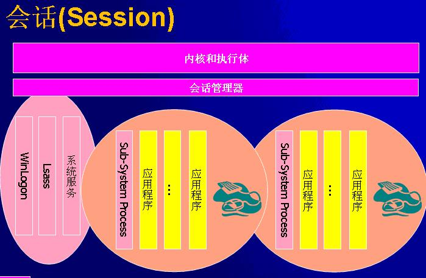
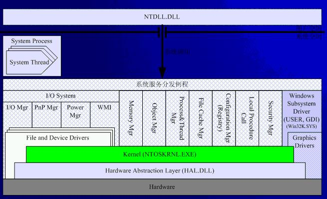
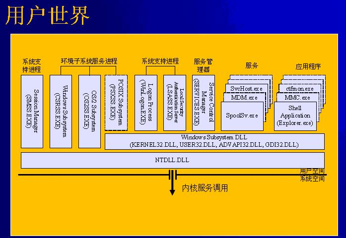

# Windows系统架构-系统角度 #

### 基本概念 ###

**CPU保护模式**

X86 CPU有多种工作模式：

* 实模式 - 又称实地址模式，段地址 + 偏移 = 物理地址
* 保护模式 - 现代CPU的Native模式，多任务和虚拟地址支持
* 系统管理模式 - 系统固件（BIOS）执行电源管理，安全检查或平台相关的任务

保护的内容：每个进程有自己的地址空间并受到保护，即保护多任务环境中的各个任务的安全。在同一个进程中，高特权的代码受到保护，即防止用户程序读写操作系统的内存。

* 用户程序不可以执行特权指令，比如lgdt等
* 用户程序不可以直接访问I/O端口和硬件寄存器
* 高特权级的代码可以执行和访问地特权级的代码和数据；反过来，地特权级的代码不可以直接执行和访问高特权级的代码和数据。

**模块及工作模式**

| 角色| 实体 | 模式 |
|-----|-----|------|
| 硬件抽象层 | HAL.DLL | 内核 |
| 内核 | NTOSKRNL.EXE | 内核 |
| 执行体 | NTOSKRNL.EXE | 内核 |
| 内核态驱动程序 | PCI.SYS，WIN32K.SYS等| 内核 |
| 系统进程 | SMSS，WinLogon，Lsass等 | 用户 |
| 子系统进程 | CSRSS，PSXSS，OS2SS | 用户 |
| 用户态驱动程序 | WINSPOOL.DRV，UMDF等 | 用户 |
| Shell | Explorer.exe | 用户 |
| 系统服务器程序 | Svchost.exe等 | 用户 |
| 应用程序 | Notepad.exe等 | 用户|

之所以引入用户态的驱动程序是基于系统安全考虑，内核态的程序异常可能会导致蓝屏，而用户态的异常不会影响到系统，只会对对应的进程有影响。

**调用内核服务**

从用户态到内核态切换：

IA32 CPU设计了专用指令（从奔腾2开始），`sysenter/sysexit`，需要使用MSR寄存器，`SYSENTER_CS_MSR`等。在此前使用的是中断`INT 2Eh`。

**会话（Session）**

内核和执行体之上就是会话管理器，其实就是`SMSS.exe`进程，它是系统启动的第一个进程。每个会话有自己的桌面，输入设备和显示输出。

在XP系统上只有一个Session，所有进程运行于一个Session中（网络登录除外）。而在Vista之后的系统中，左侧的系统进程都运行于Session0，而在右侧的两个会话则是运行于各自的会话中。

### 内核架构和内核文件 ###

模块组织：

* NTOS(Kernel-mode Services)
	NTOSKRNL.EXE
    Scheduling，即内核
    Runtime Library，Executive Services，Object manager,memory
* Hal（Hardware Abstraction Layer）
	为NTOS即驱动程序提供隔离硬件差异
    硬件操作
* Drivers
	扩展内核功能，管理设备

### 异常和中断处理 ###

中断，来源于CPU外；异常来源于CPU内部。

Interrupt Descriptor Table，中断描述符表是中断和异常的中枢，一共有256项，每项都是一个中断的处理程序，它是CPU和操作系统的最重要的接口。初始化IDT是系统启动的早期工作之一。

### 环境子系统 ###

* 一个内核，多个子系统
	OS/2，POSIX，Windows
    Windows子系统具有特殊地位，必不可少
* 用户态进程 CSRSS.EXE
	Client/Server Runtime Server Subsystem（CSRSS.exe）
    WINSRV.dll：控制台窗口，HardError
    CSRSRV.DLL：进程，线程维护，调试（WinXP之前）
    BASESRV.DLL：安全，登录
* 内核模块，Win32K.sys
	GDI，窗口绘制
    USER，用户输入输出

### 进程和线程 ###

线程：CPU的基本调度单位，在Windows中线程就可以认为是任务，每个线程都有一个任务状态段（Task State Segment）。

进程：线程的容器，OS组织和管理程序的单位。

`EPROCESS`内核中表示进程的结构，`!process 0 0`，`!process 4`，`dt nt!_EPROCESS`。在应用层的基本结构是PEB，`dt nt!_PEB`查看结构内容。

`KTHREAD`内核中表示线程的结构。`TEB`是R3层表示线程的结构，`GetLastError()`函数就是从TEB中获取的值，每个线程的LastError存在于TEB结构中。

