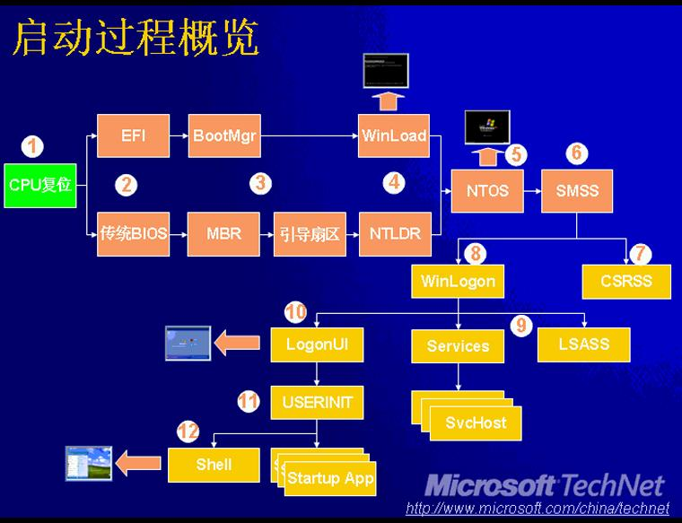
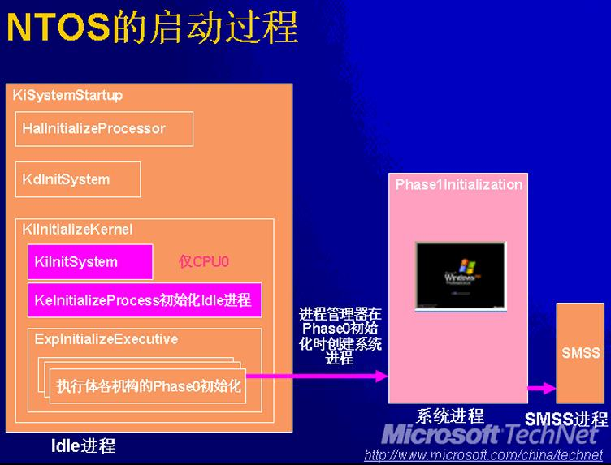

参与启动过程的软硬件：

* ROM中的POST（Power On Self-test）代码，BIOS一部分
* BIOS/EFI（Extended Firmware Interface）
* MBR（Main Boot Record） 主引导扇区
* 引导扇区（Boot sector）
* NTLDR（XP及之前）/WinLoad（Vista及之后系统）
* NTOSKRNL/HAL/BOOTVID/KDCOM
* SMSS.EXE   会话管理进程
* CSRSS.EXE  Win32子系统
* WinLogon.EXE 登录进程



第一步为CPU复位，CPU复位后会开始执行特定地址的代码，及`0x7C00`

NTLDR/WinLoad用来显示启动程序的菜单。

NTOS是其中初始化时间最长的部分。

###MBR及引导扇区###

在XP上，引导的重要文件位于系统盘（通常为C盘），其中包括内核加载器`ntldr`，引导菜单配置`boot.ini`，`hiberfil.sys`是系统休眠保存内存信息用，`NTDETECT.COM`是供ntldr调用，用来检测硬件的程序，`Pagefiles.sys`则是分页文件。此外还有`io.sys`，`msdos.sys`文件，它们是DOS时代的遗留物。

NTLDR是Windows操作系统的加载程序，位于系统盘的根目录。完成任务：

* 是CPU从16位实模式进入32位的保护模式
* 启用CPU的页基址（Paging）
* 如果是SCSI硬盘，则加载BtBootDD.sys用于访问硬盘，否则使用INT 13
* 如果发现有效的hiberfil.sys，则加载并恢复Hibernate
* 打开Boot.ini文件，读取其中设置，如果有多个项目，则显示菜单

如果选择引导系统，那么NTLDR则继续执行。

* 加载并执行ntdetect.com程序，调用BIOS收集系统的基本信息（时间，总线类型，磁盘，输入输出，显卡），将信息保存到注册表中的HKLM\Hardware\Description中
* 显示启动进度条（Win2K）或启动Splash
* 加载系统目录（`<WINROOT>\System32`）下的NTOSKRNL.EXE和HAL.DLL，以及它们所依赖的模块
* 加载注册表的System Hive，加载其中定义的boot类型为（SERVICE_BOOT_START（0））的驱动
* 执行NTOSKRNL.EXE的入口函数

### NTOSKRNL.EXE ###

Windows内核和执行体的PE文件映像，其中包括内核，执行体，以DLL方式输出函数给HAL和其他模块，内核服务的实现，系统初始化和启动部分逻辑。

`KeStartAllProcessors()`函数用于启动所有CPU，完成工作有如下这些：

* 设置GDT，IDT，TSS
* 用于处理Double Fault异常的TSS和栈
* 用于处理NMI中断的TSS和栈
* 分配DPC栈
* 将ProcessorState的ContextFrame结构的EIP字段指向KiSystemStartup()函数
* 调用KiInitializePcr初始化CPU的PCR结构体和PRCB结构体（CPU的状态结构体）
* 调用HalStartNextProcess()，启动并初始化其他的CPU

NTOS的启动过程如下所示，其中Idle进程中每个字符串都是内核中的一个函数。



从图中可以看到NTOS的初始化分为两个阶段，Phase0和Phase1来划分，阶段0的初始化主要是完成Idle进程，在阶段1中实现系统进程的初始化。

**KiSystemStartup**

* 递增全局变量 KeNumberProcessors
* 调用HalInitializeProcessor()函数，做CPU的进一步初始化
* 执行KdInitSystem() 初始化内核调试引擎
* 调用KiInitializeKernel()初始化内核数据结构，创建IDLE线程，启动初始化执行体
* 将IRQL降到DISPATCH_LEVEL，然后跳转到KiIdleLoop()，功成名就退化为Idle进程

内核调试的最早时机是如下的栈：

```
kd> k
ChildEBP RetAddr Args to Child
80549c5c 80683baa nt!RtlpBreakWithStatusInstruction (FPO: [1,0,0])
80549de8 80690d48 nt!ExpInitializeExecutive+0x350 (FPO: [Non-Fpo])
80549e3c 8068e99b nt!KiInitializeKernel+0x3b2 (FPO: [Non-Fpo])
00000000 00000000 nt!KiSystemStartup+0x2bf
```

要将调试断到最早的位置，可以使用`Debug -> Kernel Connection -> Cycle Initial Break`选项勾选来实现。此时系统中还只有初始的进程和线程，即后来的Idle进程（PID=0），此时是没有进程列表的，这些命令无法执行。

**KiInitializeKernel**

如果是bootstrap的CPU（0号），则初始化公共的数据结构，并调用KiInitSystem()。调用KeInitializeThread()初始化线程（最终的Idle线程）。调用`ExpInitializeExecutive()`以初始化执行体，执行体的初始化分为两个阶段：

* 阶段0：KiInitializeKernel调用ExpInitializeExecutive发起，由初始的单线程环境中执行各个执行体的Phase0初始化函数。
* 阶段1：在系统进程的初始线程中执行，此时已经创建了多个线程，但是大多数时候只有初始线程在执行。

`nt!InitializationPhase`全局变量标识了当前所处的阶段。

阶段0中会调用各个组件的阶段0的初始化函数：

* 内存管理器：构建页表和内部数据结构
* 对象管理器：ObInitSystem，建立名称空间
* 安全：SeInitSystem，初始化token对象类型
* 进程管理器：PsInitsystem（0，LoaderParaBlock），定义进程与线程对象类型；建立记录活动继承和线程的链表（PsActiveProcessHead）；为初始的进程建立进程对象（PsIdleProcess）；创建系统进程（PsInitialSystemProcess）和线程，起始地址指向Phase1Initialization。
* PnP管理器：初始化Executive类型的资源，用于同步


阶段1：

25%~75%：

I/O管理器初始化

75%~80%：

MmInitSystem(2, LoaderParaBlock)，释放启动过程使用的内存
如果安全模式启动则将信息写入注册表：

80~85%:

* KeI386VdmInitialize：Dos虚拟机初始化
* KiLogMcaErrors：检查和记录MCA
* PoInitSystem(1): 电源管理器

85~90%:

MmFreeLoaderBlock: 加载即将结束，释放加载参数块

90~100%:

* RtlCreateUserProcess()：创建SMSS进程，真正意义上的从映像文件启动的进程
* FinalizeBootLogo()
* ZwResumeThread()
* InbvUpdateProgressBar(0x64)
* InbvEnableDisplayString(1)
* ZwWaitForSingleObject：等待五分钟，如果5秒内SMSS进程退出，则蓝屏终止系统
* 此后这个线程转为Zero Page线程

###SMSS###

Session Manager

###WinLogon###

* 启动LSASS进程（Local Security Authority SubSystem）


### 登录过程 ###


    


